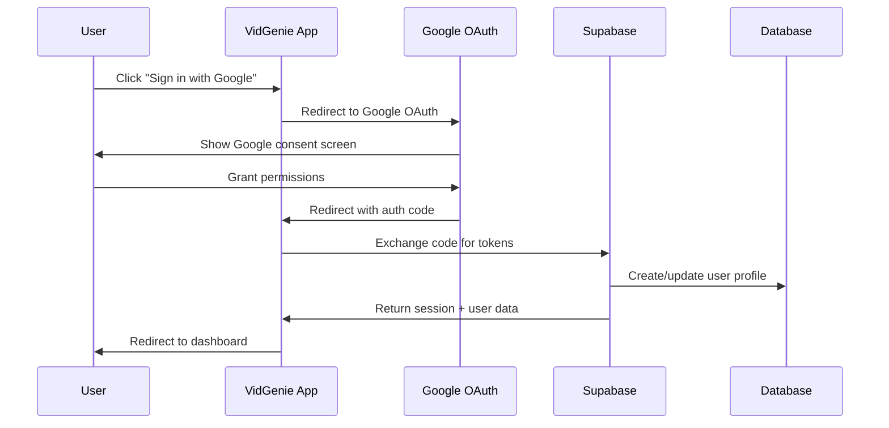

# 🔐 Configuration Google OAuth 2.0 / OpenID Connect - VidGenie

## 📋 Vue d'ensemble

Cette documentation vous guide pour configurer l'authentification Google OAuth 2.0 / OpenID Connect dans VidGenie, en utilisant les **meilleures pratiques de sécurité** et une intégration **production-ready**.

## 🛠️ Configuration Google Cloud Platform

### 1. Créer un projet GCP

1. **Accédez à [Google Cloud Console](https://console.cloud.google.com/)**
2. **Créez un nouveau projet** ou sélectionnez un projet existant
3. **Notez votre Project ID** (ex: `vidgenie-prod-123456`)

### 2. Activer l'API Google+

```bash
# Via gcloud CLI (optionnel)
gcloud services enable plus.googleapis.com
gcloud services enable oauth2.googleapis.com
```

Ou via l'interface web :
1. **APIs & Services** → **Library**
2. Recherchez **"Google+ API"** et **"OAuth2 API"**
3. Cliquez **"Enable"** pour chaque API

### 3. Configurer OAuth Consent Screen

1. **APIs & Services** → **OAuth consent screen**
2. **Type d'utilisateur** : External (pour un SaaS public)
3. **Informations de l'application** :
   - **App name** : `VidGenie`
   - **User support email** : `support@vidgenie.com`
   - **Logo** : Upload votre logo (120x120px minimum)
   - **App domain** : `https://vidgenie.com`
   - **Authorized domains** :
     ```
     vidgenie.com
     localhost (pour développement)
     ```
   - **Developer contact** : `tech@vidgenie.com`

4. **Scopes** requis :
   ```
   openid
   email
   profile
   https://www.googleapis.com/auth/userinfo.email
   https://www.googleapis.com/auth/userinfo.profile
   ```

5. **Test users** (phase de développement) :
   ```
   dev@vidgenie.com
   test@vidgenie.com
   ```

### 4. Créer les OAuth Credentials

1. **APIs & Services** → **Credentials**
2. **Create Credentials** → **OAuth 2.0 Client IDs**
3. **Application type** : `Web application`
4. **Name** : `VidGenie OAuth Client`

5. **Authorized JavaScript origins** :
   ```
   # Développement
   http://localhost:3000
   http://127.0.0.1:3000
   
   # Production
   https://vidgenie.com
   https://www.vidgenie.com
   ```

6. **Authorized redirect URIs** :
   ```
   # Développement
   http://localhost:3000/api/auth/google/callback
   http://localhost:3000/auth/callback
   
   # Production  
   https://vidgenie.com/api/auth/google/callback
   https://vidgenie.com/auth/callback
   ```

7. **Téléchargez le JSON** des credentials et **copiez** :
   - **Client ID** : `123456789-abcdefgh.apps.googleusercontent.com`
   - **Client Secret** : `GOCSPX-abcdefghijklmnop`

## 🔧 Variables d'environnement

### Development (.env.local)
```bash
# Google OAuth
GOOGLE_CLIENT_ID="123456789-abcdefgh.apps.googleusercontent.com"
GOOGLE_CLIENT_SECRET="GOCSPX-abcdefghijklmnop"

# JWT Secrets (générez avec openssl rand -base64 32)
JWT_SECRET="your-32-character-secret-here"
NEXTAUTH_SECRET="your-32-character-secret-here"

# URLs
NEXTAUTH_URL="http://localhost:3000"
NEXT_PUBLIC_APP_URL="http://localhost:3000"
```

### Production (.env)
```bash
# Google OAuth
GOOGLE_CLIENT_ID="prod-client-id.apps.googleusercontent.com"
GOOGLE_CLIENT_SECRET="GOCSPX-prod-client-secret"

# JWT Secrets (différents de dev!)
JWT_SECRET="production-jwt-secret-32-chars"
NEXTAUTH_SECRET="production-nextauth-secret-32"

# URLs Production
NEXTAUTH_URL="https://vidgenie.com"
NEXT_PUBLIC_APP_URL="https://vidgenie.com"
```

## 🔐 Génération des secrets sécurisés

```bash
# Générer des secrets JWT forts
openssl rand -base64 32
# Exemple output: vX8k2L9mN1pQ3rT5yU7wE9qA2sD4fG6h

# Alternative avec Node.js
node -e "console.log(require('crypto').randomBytes(32).toString('base64'))"
```

## 🚀 Intégration Supabase

### Configuration Supabase Dashboard

1. **Authentication** → **Providers** → **Google**
2. **Enable Google provider** : `ON`
3. **Client ID** : Votre Client ID Google
4. **Client Secret** : Votre Client Secret Google
5. **Redirect URL** (auto-générée) :
   ```
   https://your-project.supabase.co/auth/v1/callback
   ```

### Ajouter l'URL Supabase dans Google Console

Retournez dans **Google Cloud Console** → **Credentials** et ajoutez :

**Authorized redirect URIs** :
```
# Supabase Auth
https://your-project.supabase.co/auth/v1/callback

# Votre app (callbacks personnalisés)
https://vidgenie.com/auth/callback
http://localhost:3000/auth/callback
```

## 📱 Flow d'authentification

### Architecture du flux OAuth



## 🛡️ Sécurité et validation

### Points de sécurité critiques

1. **CSRF Protection** : State parameter dans OAuth flow
2. **Token Validation** : Vérification signature JWT Google
3. **Domain Restriction** : Limitation des domaines autorisés
4. **Session Security** : Cookies HTTPOnly + Secure
5. **Rate Limiting** : Protection contre les attaques par force brute

### Validation des tokens ID

```typescript
import { OAuth2Client } from 'google-auth-library';

const client = new OAuth2Client(
  process.env.GOOGLE_CLIENT_ID,
  process.env.GOOGLE_CLIENT_SECRET
);

// Valider le token ID Google
async function verifyGoogleToken(idToken: string) {
  const ticket = await client.verifyIdToken({
    idToken,
    audience: process.env.GOOGLE_CLIENT_ID,
  });
  
  const payload = ticket.getPayload();
  if (!payload) throw new Error('Invalid token');
  
  return {
    googleId: payload.sub,
    email: payload.email,
    name: payload.name,
    picture: payload.picture,
    emailVerified: payload.email_verified
  };
}
```

## 📚 Configuration avancée

### Personnalisation du consent screen

```typescript
// Paramètres OAuth personnalisés
const oauthParams = {
  access_type: 'offline',
  prompt: 'consent',
  include_granted_scopes: true,
  hd: 'vidgenie.com', // Restreindre à un domaine (optionnel)
  login_hint: 'user@vidgenie.com' // Pré-remplir email (optionnel)
};
```

### Gestion des erreurs OAuth

```typescript
const OAUTH_ERRORS = {
  'access_denied': 'L\'utilisateur a refusé l\'accès',
  'invalid_request': 'Paramètres OAuth invalides',
  'unauthorized_client': 'Client non autorisé',
  'unsupported_response_type': 'Type de réponse non supporté',
  'invalid_scope': 'Scope invalide',
  'server_error': 'Erreur serveur Google',
  'temporarily_unavailable': 'Service temporairement indisponible'
};
```

## 🧪 Tests de configuration

### Test des URLs de redirection

```bash
# Test du endpoint de callback
curl -X GET "http://localhost:3000/api/auth/google/callback?code=test&state=test"

# Vérifier les headers CORS
curl -H "Origin: http://localhost:3000" \
     -H "Access-Control-Request-Method: GET" \
     -H "Access-Control-Request-Headers: Content-Type" \
     -X OPTIONS \
     "http://localhost:3000/api/auth/google"
```

### Validation manuelle du flow

1. **Ouvrir** : `http://localhost:3000/auth/signin`
2. **Cliquer** : "Sign in with Google"
3. **Vérifier** : Redirection vers Google
4. **Vérifier** : Retour vers votre app après consent
5. **Vérifier** : Création du profil utilisateur dans Supabase

## 🔄 Migration depuis l'OAuth Supabase simple

Si vous utilisez déjà l'OAuth Google via Supabase :

```typescript
// Ancien (Supabase simple)
await supabase.auth.signInWithOAuth({ provider: 'google' });

// Nouveau (OAuth personnalisé + Supabase)
await authService.signInWithGoogle(); // Avec validation complète
```

## 📊 Monitoring et métriques

### Événements à tracker

```typescript
// Analytics des connexions OAuth
const trackOAuthEvent = (event: string, provider: string) => {
  analytics.track(event, {
    provider,
    timestamp: new Date().toISOString(),
    userAgent: navigator.userAgent
  });
};

// Utilisation
trackOAuthEvent('oauth_started', 'google');
trackOAuthEvent('oauth_completed', 'google');
trackOAuthEvent('oauth_failed', 'google');
```

## 🔧 Troubleshooting

### Erreurs courantes

#### "redirect_uri_mismatch"
**Cause** : L'URL de redirection n'est pas configurée dans Google Console
**Solution** : Ajouter l'URL exacte dans "Authorized redirect URIs"

#### "invalid_client"
**Cause** : Client ID ou Secret incorrect
**Solution** : Vérifier les variables d'environnement

#### "access_blocked"
**Cause** : App en mode développement avec utilisateur non autorisé
**Solution** : Ajouter l'utilisateur dans "Test users" ou publier l'app

### Debug des tokens

```typescript
// Debug du token ID (développement uniquement)
import jwt from 'jsonwebtoken';

const decoded = jwt.decode(idToken, { complete: true });
console.log('Token header:', decoded?.header);
console.log('Token payload:', decoded?.payload);
```

## 🎯 Checklist de production

- [ ] **GCP Project** configuré avec APIs activées
- [ ] **OAuth Consent Screen** complété et vérifié
- [ ] **Credentials** créées avec URLs correctes
- [ ] **Variables d'environnement** sécurisées en production
- [ ] **Supabase Provider** configuré
- [ ] **URLs de redirection** testées
- [ ] **Flow complet** testé (signup + signin)
- [ ] **Gestion d'erreurs** implémentée
- [ ] **Rate limiting** configuré
- [ ] **Monitoring** en place

## 🚨 Sécurité Production

### Bonnes pratiques

1. **Secrets Management** : Utilisez un gestionnaire de secrets (AWS Secrets Manager, GCP Secret Manager)
2. **Domain Restriction** : Limitez les domaines autorisés
3. **Rate Limiting** : Implémentez une limitation des tentatives
4. **Audit Logs** : Loggez toutes les tentatives d'authentification
5. **HTTPS Only** : Forcez HTTPS en production
6. **SameSite Cookies** : Configurez les cookies sécurisés

### Variables sensibles

```bash
# ⚠️ JAMAIS commiter ces valeurs !
GOOGLE_CLIENT_SECRET=     # À garder secret
JWT_SECRET=               # À garder secret
NEXTAUTH_SECRET=          # À garder secret
```

## 📞 Support

### Logs utiles

```typescript
// Logger les erreurs OAuth
console.error('OAuth Error:', {
  error: error.code,
  message: error.message,
  timestamp: new Date().toISOString(),
  userAgent: req.headers['user-agent']
});
```

### Contact Google Support

En cas de problème avec votre app OAuth :
1. **Google Cloud Support** (si vous avez un plan payant)
2. **Community Support** : [Stack Overflow](https://stackoverflow.com/questions/tagged/google-oauth)
3. **Documentation** : [Google Identity](https://developers.google.com/identity)

---

**✅ Prêt pour l'implémentation !** Cette configuration garantit une intégration Google OAuth sécurisée et production-ready.